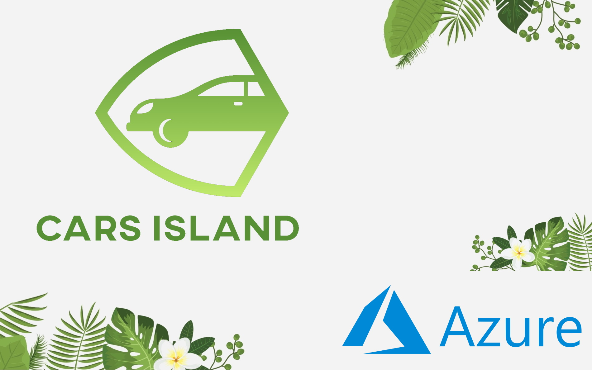

# Cars Island Car Rental on the Azure cloud
 
*- This repository contains sample project where different Azure cloud services were used*

*- Some of the concepts were simplified to make it possible to deliver complete solution*

*- On my [tech blog](https://daniel-krzyczkowski.github.io/Cars-Island-Car-Rental-On-Azure-Cloud/) there is a series of articles where I described implementation details*

Cars Island is a fake car rental company which used Microsoft Azure cloud services to implement the system for managing car renting.

*If you like this content, please give it a star!*

## Use cases are following:

1. Customer can create account (register)
2. Customer can sign in
3. Customer can display list of all available cars
4. Customer can make a reservation for a specific car (if it is not already reserved by other customer)
5. Customer can send new enquiry and attach the file

### Here are the screenhots of the web app together with the confirmation email template:

### There is also Open API definition available for the Cars Island Web API:

# General overview of solution architecture

## Solution architecture

Below diagram presents Cars Island Car Rental system architecture. 

## Azure Active Directory B2C

Azure Active Directory B2C is an identity service in the Azure cloud that enables user authentication and management. Implementing own identity service can be challenging. Try to think about data storage, secure connections, or token generation and validation. With Azure AD B2C, adding user authentication is much easier. In the Cars Island solution users can create accounts and login to access some of the functionalities. What is more - with Azure AD B2C, login, registration, password reset, or profile edit pages can be customized and branded (like with the company logo or background). You do not have to implement login, or registration views yourself.

## Azure Key Vault

Security is a very important aspect of every project. Secrets and credentials should be stored in the secure store. This is why Azure Key Vault is used in the Cars Island solution. Parameters like connection string to the database or storage key are stored in the Azure Key Vault instance.

## Azure Application Insights

Tracking issues in cloud solutions can be challenging. Collecting logs and detecting bugs can be hard. This is why it is good to use an Application Performance Management service like Azure Application Insights. With this Azure cloud service, we can log all events and errors that occure in our solution. Azure Application Insights provides SDKs in many languages (like C# oraz Java) so we can easily integrate them with our application. All logs are then available in the Azure portal, where rich dashboards are displayed with collected log data.

## Azure Web Apps with App Service Plans

Hosting web applications in the Azure cloud is much easier with Azure Web Apps. Cars Island Web portal is written with Blazor framework and Cars Island API is written with ASP .NET Core. These web applications are hosted using Azure Web Apps. Azure App Service Plans provide a way to scale in and out, up and down so you can apply automatic scale when there is higher load and traffic. With Azure Web Apps we can also use custom SSL certificates.

## Azure Function Apps

Azure Function Apps are serverless services available in the Azure cloud. They are ideal to be used as event handlers for processing events. It is important to mention the cost - you only pay for this service once it is executed. Up to 1 million executions is for free. In the Cars Island solution, Azure Function App was used to handle events related to sending car's reservation confirmation emails once custom complete reservation in the web portal. This Function App is triggered once there is a new message in the Azure Service Bus queue.

## Azure Service Bus

Azure Service Bus service is a cloud messaging service. With Azure Service Bus we can build reliable and elastic cloud apps with messaging. In the Cars Island solution, Azure Service Bus queues were used to queue car's reservation confirmations to send emails to customers. Once car's reservation is completed in the web portal, information is passed to the API and saved in the database. After this process, there is new message sent to the queue. Then Azure Function is triggered and new email is sent using Azure SendGrid Service.

## Azure SendGrid

Azure SendGrid service enables sending customized emails. It is great because we can create email templates but also it provides SDK that we can use to implement emails sending in the source code. Up to 25.000 emails, it is free.

## Azure Cosmos DB

Azure Service Bus is a globally distributed database available in the Azure cloud. Data about all cars and reservations is stored in this database in the Cars Island solution.

## Azure Storage Account

Azure Storage Account is one of the oldest services available in the Azure cloud. It provides an easy way to store different kind of files using Blob Storage. In the Cars Island solution, it is used to store car images that are then displayed in the web portal.

## Azure API Management

Azure API Management is a service that works as a gateway to different APIs behind it. With Azure API Management you can secure your APIs. It provides a different kind of policies so for instance we can implement throttling or validate tokens. In the Cars Island solution, it was used to protect access to Cars Island API.

## Technology used to develop Web API, Mail Sender App and Web portal

### Cars Island web application was developed with Blazor Server. (.NET 5.0)

### Cars Island Web API was developed with ASP .NET Core (.NET 5.0)

### Cars Island Mail Sender Function App was developed with .NET Core (3.1)

# Repository structure

In the *src* folder there are five sub-folders:

1. *[ad-b2c-custom-policies](https://github.com/Daniel-Krzyczkowski/Cars-Island-On-Azure/tree/master/src/ad-b2c-custom-policies)* - this one contains Azure AD B2C custom policies files together with branding files
2. *[arm-templates](https://github.com/Daniel-Krzyczkowski/Cars-Island-On-Azure/tree/master/src/arm-templates)* - this one contains Azure Resource Manager templates to create all required Azure services
3. *[func-app](https://github.com/Daniel-Krzyczkowski/Cars-Island-On-Azure/tree/master/src/func-app)* - this one contains source code of the Function App responsible for sending email confirmations when car is reserved
4. *[web-api](https://github.com/Daniel-Krzyczkowski/Cars-Island-On-Azure/tree/master/src/web-api)* - this one contains ASP .NET Core Web API project
5. *[web-app](https://github.com/Daniel-Krzyczkowski/Cars-Island-On-Azure/tree/master/src/web-app)* - this one contains Blazor Web App project
6. *[send-grid-mail-template](https://github.com/Daniel-Krzyczkowski/Cars-Island-On-Azure/tree/master/src/send-grid-mail-template)* - this one contains SendGrid email template for car reservation confirmation

